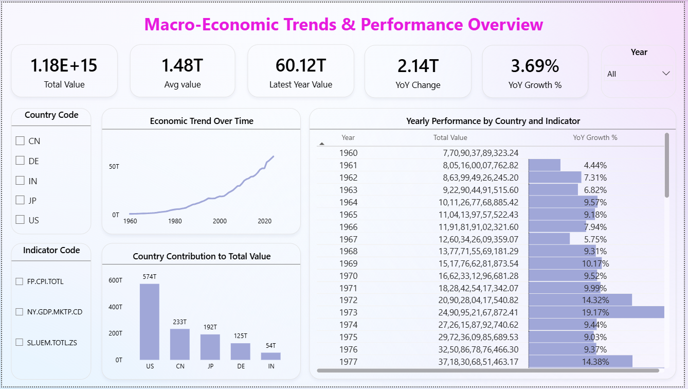

🌍 Automated Macro-economic Data Analytics & Pipeline

End-to-end automated data pipeline for collecting, transforming, and analyzing global macroeconomic indicators to support data-driven economic insights and trend analysis.

📌 Contents

<a href="#overview">Overview</a>

<a href="#business-problem">Business Problem</a>

<a href="#data-sources">Data Sources</a>

<a href="#tools--technologies">Tools & Technologies</a>

<a href="#project-architecture">Project Architecture</a>

<a href="#project-structure">Project Structure</a>

<a href="#data-pipeline-workflow">Data Pipeline Workflow</a>

<a href="#dashboard--analytics">Dashboard & Analytics</a>

<a href="#key-insights">Key Insights</a>

<a href="#business-recommendations">Business Recommendations</a>

<a href="#how-to-run-this-project">How to Run This Project</a>

<a href="#author--contact">Author & Contact</a>

<h2><a class="anchor" id="overview"></a>Overview</h2>

This project builds a fully automated data pipeline to ingest, process, and analyze global macroeconomic indicators across countries and years. The solution integrates public economic APIs, applies structured data modeling, enforces data quality checks, and delivers interactive analytics through Power BI to support high-level economic trend evaluation and comparative analysis.

<h2><a class="anchor" id="business-problem"></a>Business Problem</h2>

Economic data is often fragmented across multiple sources, updated at different frequencies, and difficult to analyze consistently over time. Without a structured pipeline, analysts face challenges in:

Tracking long-term economic trends

Comparing indicators across countries

Ensuring data freshness and reliability

Supporting executive-level decision-making with trusted insights

This project addresses these challenges by building a scalable, automated, and auditable analytics pipeline.

<h2><a class="anchor" id="data-sources"></a>Data Sources</h2>

World Bank API – Annual macroeconomic indicators (GDP, inflation, etc.)

FRED API – Selected economic series for extensibility

Data is ingested programmatically using REST APIs and stored with ingestion timestamps for lineage tracking

<h2><a class="anchor" id="tools--technologies"></a>Tools & Technologies</h2>

Python (Requests, Pandas, Logging)

SQL / SQLite (Data modeling & transformations)

REST APIs (World Bank, FRED)

Power BI (Interactive analytics & executive reporting)

Windows Task Scheduler (Automation)

GitHub (Version control & project documentation)

<h2><a class="anchor" id="project-architecture"></a>Project Architecture</h2>

High-Level Flow:

APIs → Raw Storage → Data Validation → Transformation Layer → Analytics Tables → Power BI Dashboard

The pipeline is modular, logged, and designed for incremental refresh without manual intervention.

<h2><a class="anchor" id="project-structure"></a>Project Structure</h2> 

```
economic-data-pipeline/
│
├── README.md
├── economic_data.db
├── run_pipeline.bat
├── .gitignore
│
├── data/
│   ├── raw/                     # Raw ingested data
│   └── processed/               # Clean analytics-ready tables
│
├── scripts/                     # Python pipeline modules
│   ├── ingest_worldbank.py
│   ├── ingest_fred.py
│   ├── transform_macro.py
│   ├── data_quality.py
│   ├── alert_email.py
│   ├── incremental_load.py
│   ├── run_pipeline.py
│   ├── data_validation.py
│   ├── export_analytics_tables.py
│   └── logger.py
    
│
├── sql/                         # SQL schema and transformations
│   └── transform_macro.sql
│   └── legacy_mysql_schema.sql
│
├── logs/                        # Pipeline execution logs
│   └── pipeline.log
│   └── pipeline_run.log
│   └── scheduler.log
│
├── dashboard/
│   └── economic_macro_model.pbix
│   └── dashboard.png
│
├── docs/
│   └── architecture.png
│   └── log_screenshot.png
│
├── Automated Data Pipeline report.docx
│
├── Automated Data Pipeline.pptx
```

<h2><a class="anchor" id="data-pipeline-workflow"></a>Data Pipeline Workflow</h2>

Automated extraction from public APIs

Raw data stored without modification (source-of-truth)

Data quality validation (nulls, invalid values, schema checks)

Transformation into fact and dimension tables

Incremental loading to avoid reprocessing historical data

Centralized logging and failure alerts

Scheduled execution using Task Scheduler

<h2><a class="anchor" id="dashboard--analytics"></a>Dashboard & Analytics</h2>

The Power BI dashboard enables:

Long-term trend analysis across years

Country-wise and indicator-wise comparisons

Growth rate evaluation analysis

Dynamic filtering without reprocessing data

Key Views Include:

Aggregate economic value trends

Country contribution analysis

Indicator-level growth patterns

Year-over-year comparisons



<h2><a class="anchor" id="key-insights"></a>Key Insights</h2>

Long-Term Aggregate Value Has Grown Consistently Over Time

Recent Period Shows Meaningful Year-over-Year Growth (3.69%)

Latest Year Contribution Is a Significant Share of Historical Total (60.12T)

Country Contribution Is Highly Skewed

Growth Rates Fluctuate Meaningfully Across Years

Automation Enables Multi-Dimensional Filtering Without Reprocessing

“US” consistently contribute higher aggregate values across indicators


<h2><a class="anchor" id="business-recommendations"></a>Business Recommendations</h2>

Prioritize indicators with sustained positive growth

Use rolling averages to reduce volatility bias

Support aggregate trends with indicator-level analysis

Maintain automated refresh for decision readiness

Extend the solution with forecasting and scenario modeling

<h2><a class="anchor" id="how-to-run-this-project"></a>How to Run This Project</h2>

Clone the repository:
```bash
git clone https://github.com/yourusername/economic-data-pipeline.git
```

Navigate to project directory:
```bash
cd economic-data-pipeline
```

Run the pipeline manually:
```bash
python scripts/run_pipeline.py
```

(Optional) Schedule execution:

- `Use run_pipeline.bat with Windows Task Scheduler for automation`

Open the Power BI dashboard:

- `dashboard/economic_macro_model.pbix`

---
<h2><a class="anchor" id="author--contact"></a>Author & Contact</h2>

**Prasanth Reddy Majji**  
Data Analyst  
📧 Email: majjiprasanthreddy@gmail.com  
🔗 [LinkedIn](https://www.linkedin.com/in/prasanthreddymajji/)  
